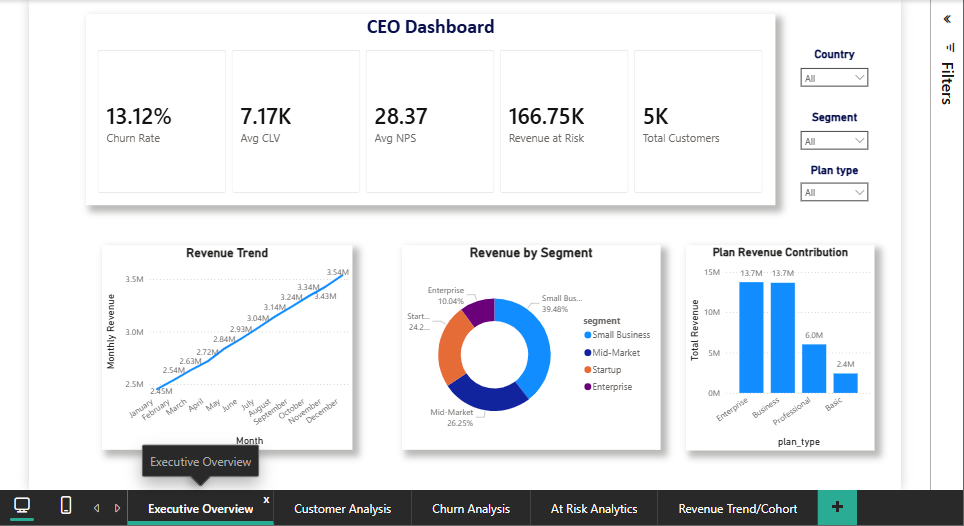
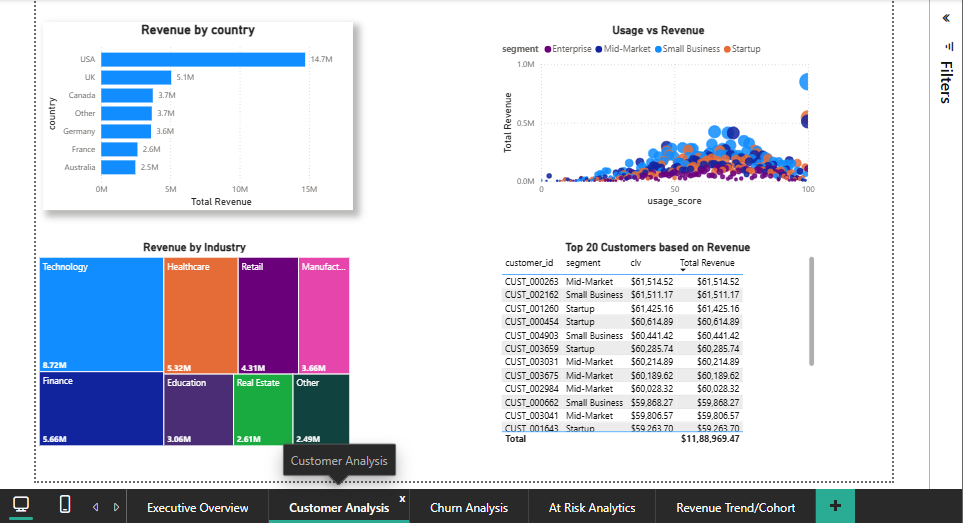
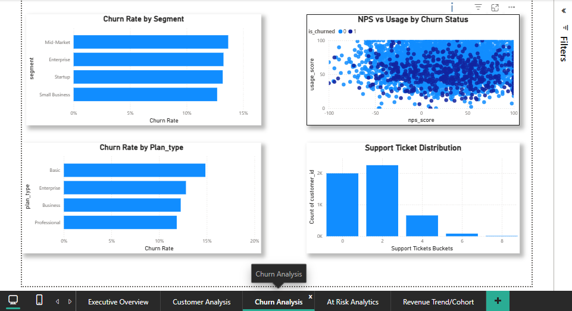
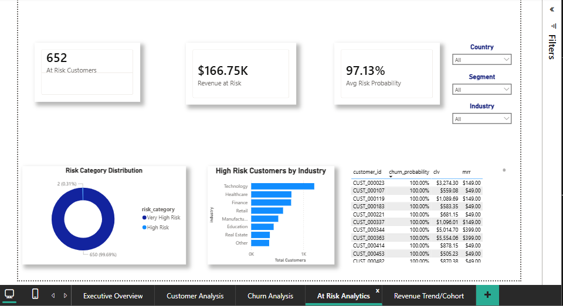
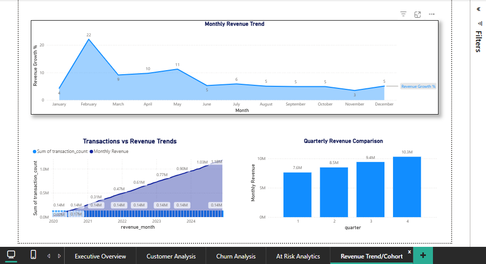

# SaaS Customer Retention & Revenue Analytics Dashboard

## Project Overview
This end-to-end analytics project analyzes SaaS customer behavior, churn risk, and revenue performance using Excel, SQL, and Power BI.

The objective was to identify churn drivers, high-risk customers, segment performance, and revenue trends to support data-driven retention strategies.

---

## Business Problem
A SaaS company wants to:

- Reduce customer churn
- Identify high-risk customers
- Improve retention strategy
- Understand customer lifetime value
- Track revenue performance over time
- Analyze segment and plan profitability

---

## Tools Used
- Excel (Data Cleaning & Transformation)
- MySQL (Data Modeling & Analytics Queries)
- Power BI (Dashboarding & Business Intelligence)

---

## Dataset
The project uses 3 datasets:

### financial_customers.csv
Customer master data:
- customer profile
- revenue
- MRR
- CLV
- NPS
- usage
- churn behavior
- support tickets
- cohort information

### at_risk_customers.csv
Predictive churn risk dataset:
- churn probability
- risk category
- customer health metrics

### monthly_revenue.csv
Revenue time-series data:
- monthly revenue
- transactions
- customer counts
- growth trends

---

## Project Workflow

### 1. Excel Data Cleaning
Performed:
- duplicate removal
- missing value checks
- date formatting
- data validation
- derived feature creation

Created:
- customer_age_months
- revenue_bucket
- nps_category
- usage_band
- support_band
- customer_status

---

### 2. SQL Analytics
Built relational database:
- customers
- at_risk_customers
- monthly_revenue

Analysis performed:
- churn analysis
- segment revenue analysis
- top customer ranking
- at-risk revenue analysis
- growth analysis
- plan performance
- industry risk assessment

SQL concepts used:
- joins
- CASE
- GROUP BY
- CTE
- window functions
- ranking functions
- aggregations

---

### 3. Power BI Dashboard
Built a 5-page interactive dashboard:

#### Executive Overview
- revenue KPIs
- churn KPIs
- segment contribution
- revenue trend

#### Customer Analysis
- customer segmentation
- country performance
- CLV analysis
- usage vs revenue

#### Churn Analysis
- churn by segment
- churn by plan
- support behavior
- NPS relationship

#### At Risk Analysis
- risk categories
- revenue at risk
- risky customers
- churn probability analysis

#### Revenue Trends
- monthly growth
- quarterly performance
- transaction trends

---

## Key Insights
Example findings:

- Enterprise customers generated the highest revenue contribution.
- Higher support ticket counts correlated with increased churn risk.
- Low NPS customers showed significantly higher churn probability.
- A small set of customers represented a large portion of total revenue.
- Revenue growth varied significantly across quarters.

---

## Dashboard Preview
# SaaS Customer Analytics Dashboard

## Executive Overview

## Customer Analysis

## Churn Analysis

## At Risk Analysis

## Revenue Trends

---

## Skills Demonstrated
Excel
- data cleaning
- feature engineering
- exploratory analysis

SQL
- joins
- aggregations
- window functions
- ranking
- business analytics queries

Power BI
- DAX
- data modeling
- KPI dashboards
- storytelling
- interactive visuals

---

## Project Files
- Excel workbook
- SQL scripts
- Power BI dashboard
- screenshots
- documentation

---

## Author
Aayush Sinha
Data Analyst | SQL | Power BI | Excel | Python
